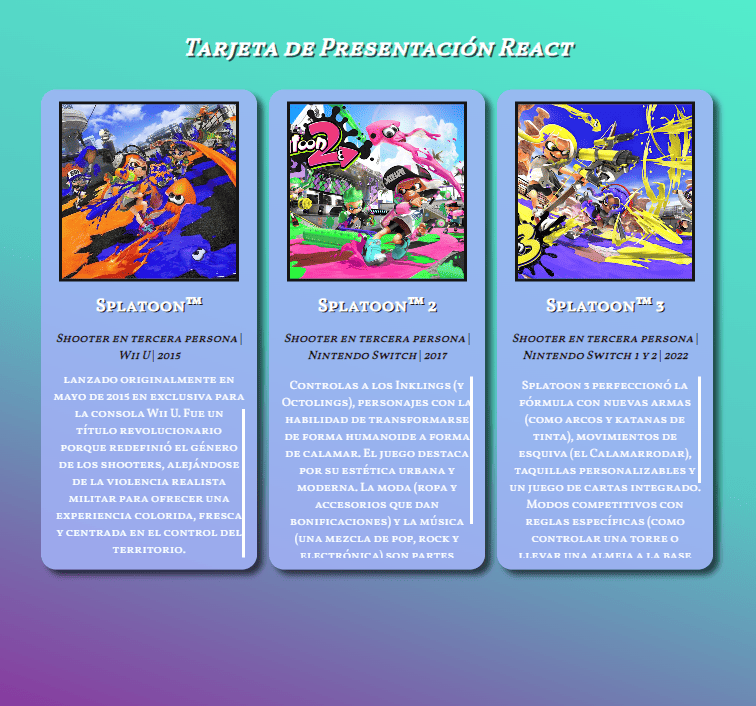
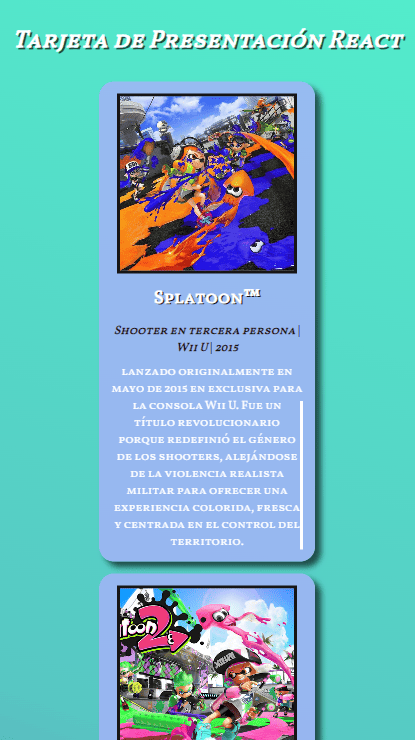

# 📇 Proyecto: Tarjeta de Presentación React

Este proyecto fue realizado con la finalidad de cumplir con la **Tarea N.º 4** del curso *Desarrollo de React*, perteneciente a la **Diplomatura en Professional Full-Stack Developer (UTN 2025/2026)**.

El objetivo principal es poner en práctica:
- Creación de componentes funcionales.
- Uso de sintaxis JSX.
- Implementación de **props** para reutilizar y personalizar contenido.

## 📸 Vista Previa




## 🚀 Instrucciones de Instalación

Sigue estos pasos para clonar y ejecutar el proyecto en tu entorno local:

### 1. Clonar el repositorio
```bash
git clone [https://github.com/terminedev/tarea-n4---curso-desarrollo-de-react---diplomatura-en-professional-full-stack-developer](https://github.com/terminedev/tarea-n4---curso-desarrollo-de-react---diplomatura-en-professional-full-stack-developer)

```

###2. Ingresar a la carpeta del proyecto```bash
cd tarea-n4---curso-desarrollo-de-react---diplomatura-en-professional-full-stack-developer

```

###3. Instalar dependenciasInstala las librerías necesarias listadas en el `package.json`:

```bash
npm install

```

###4. Ejecutar el proyectoLevanta el servidor de desarrollo local:

```bash
npm run dev

```

###5. Ver el resultadoAbre tu navegador en la dirección que indique la terminal (usualmente es la siguiente, pero puede variar):

> http://localhost:5173

---

##🛠️ Tecnologías utilizadas* **React JS** (Componentes funcionales y Hooks)
* **CSS** (Estilos personalizados)
* **Vite** (Entorno de desarrollo)

##👤 Créditos del autor* **Gastón Términe** | 2025
* [Perfil de GitHub](https://github.com/terminedev)
* *Curso Desarrollo de React, Diplomatura en Professional Full-Stack Developer (UTN 2025/2026)*
* Módulo 1 - Unidad 4

